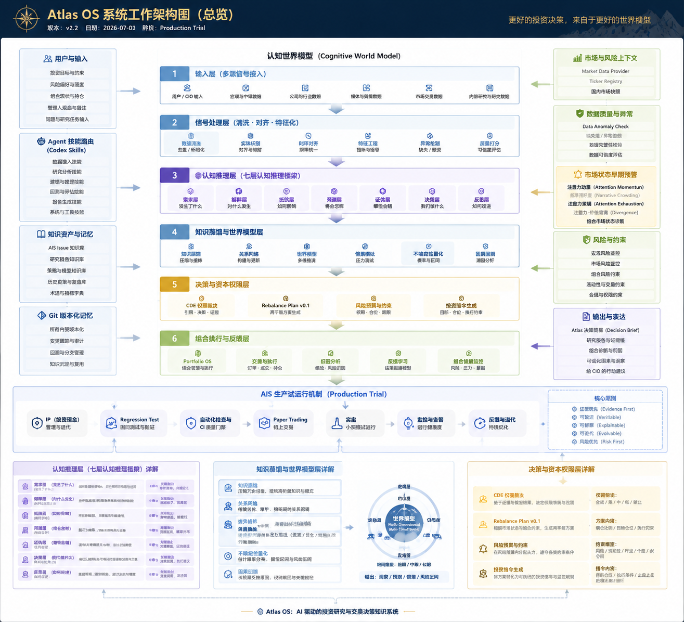
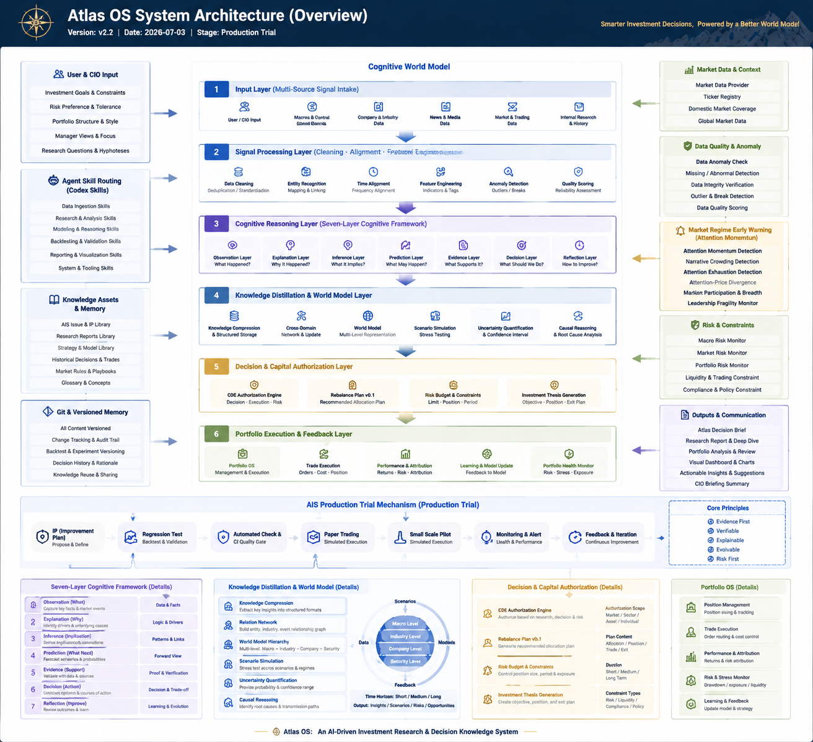

# Atlas OS v2.2 Architecture Check

Date: 2026-07-05

## Diagram Assets

Chinese overview:

English overview:

Source assets:

- `docs/assets/atlas-os-v2.2-architecture.png`
- `docs/assets/atlas-os-v2.2-architecture_en.png`

## Asset Verification

| Asset | Size | SHA-256 |
|---|---:|---|
| `docs/assets/atlas-os-v2.2-architecture.png` | 1315 x 1196 | `7b87206a11a7da9ca6f0fd8b6d4ba0bf742beb6fe786101fd4f049a18fb74223` |
| `docs/assets/atlas-os-v2.2-architecture_en.png` | 1312 x 1199 | `c6fa6315aecdf1fdf7bde916f9783ac29362d04756f5d4f25d0b521cce4eefb2` |

## Summary

The v2.2 architecture diagrams match the current Atlas OS Production Trial direction as visual
architecture references.

The diagrams show Atlas OS as a decision knowledge system centered on:

- Cognitive World Model.
- Signal processing and feature alignment.
- Seven-Layer Cognitive Framework.
- Knowledge Distillation and World Model update.
- Decision and Capital Authorization.
- Portfolio Execution and Feedback.
- AIS Production Trial mechanism.
- Market Regime Early Warning centered on Attention Momentum.

## Architecture Alignment

| Diagram Area | Repository Status | Evidence |
|---|---|---|
| User / CIO Input | Implemented as response policy, AGENTS rules, and portfolio context rules | `AGENTS.md`, `08_Daily_Operating_Cycle/` |
| Agent Skill Routing | Implemented as repo-scoped Codex skills | `.agents/skills/` |
| Knowledge Assets and Memory | Implemented as repository Markdown assets and issue / IP libraries | `09_Knowledge/`, `10_Production_Trial/` |
| Git and Versioned Memory | Implemented through repository history, changelog, audit reports, and session logs | `CHANGELOG.md`, `99_Verification/`, `docs/codex-sessions/` |
| Cognitive World Model | Implemented as the highest active knowledge structure | `09_World_Model/World_Model.md` |
| Signal Processing | Implemented as routing / classification rules and market-data validation utilities | `AGENTS.md`, `tools/market_data/` |
| Seven-Layer Cognitive Framework | Implemented as core reasoning discipline | `00_Core/Seven_Layer_Reasoning.md` |
| Knowledge Distillation and World Model | Implemented as knowledge merge and world-model procedures | `09_Knowledge/`, `09_World_Model/` |
| Decision and Capital Authorization | Implemented through Decision Engine, CDE, Rebalance Plan, and proposed risk constraints | `07_Decision_Engine/`, `10_Capital_Deployment_Engine/`, `06_Portfolio/Rebalance_Execution_Plan_v0.1.md` |
| Market Data and Context | Implemented through market data provider setup and ticker registry | `tools/market_data/` |
| Data Quality and Anomaly | Implemented through Domestic Market Snapshot and Data Anomaly Check | `tools/market_data/domestic_market_snapshot.py`, `tools/market_data/data_anomaly_check.py` |
| Market Regime Early Warning | Proposed architecture only; not implemented | `10_Production_Trial/Architecture/IP-2026-021_Market_Regime_Early_Warning_Architecture.md` |
| AIS Production Trial Mechanism | Implemented as issue-first production-trial governance | `10_Production_Trial/Issue_Policy.md`, `10_Production_Trial/Issues/`, `10_Production_Trial/Improvement_Candidates/` |
| Output and Communication | Implemented through Decision Brief and response policy | `08_Daily_Operating_Cycle/Decision_Brief_Template.md`, `08_Daily_Operating_Cycle/Atlas_Response_Policy.md` |

## Important Boundary Notes

- The diagrams are visual architecture references, not runtime implementation.
- Market Regime Early Warning remains proposed architecture only and is not a new Engine.
- Risk Budget / Constraints shown in the diagram should be read as roadmap / proposed scope unless
  separately approved by Issue, IP, Architecture Review, and Acceptance Test.
- Production Trial remains architecture-frozen: new runtime systems require explicit user approval.
- No private portfolio data is stored in these diagrams or this check.

## Result

PASS

The v2.2 Chinese and English diagrams are valid repository architecture assets and are now indexed
from the architecture documentation.
