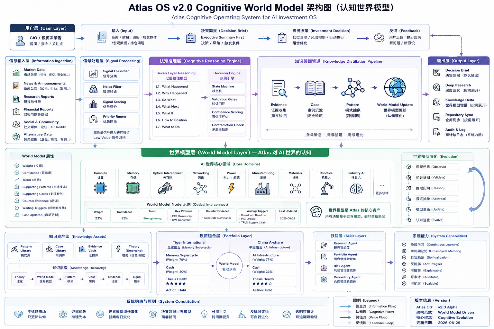

# Atlas OS v2.0 Cognitive World Model Architecture Check

Date: 2026-06-29

Diagram:



Source asset:

- `docs/assets/atlas-os-v2-cognitive-world-model-architecture.png`

## Summary

The diagram matches the current Atlas OS v2.0 Alpha direction.

Atlas is now organized around Cognitive World Model:

```text
Input
 ↓
Signal Processing
 ↓
Cognitive Reasoning
 ↓
Knowledge Distillation
 ↓
World Model
 ↓
Decision Brief / Portfolio / Feedback
```

## Architecture Alignment

| Diagram Layer | Repository Status | Evidence |
|---|---|---|
| User Layer | Implemented as response policy and AGENTS rules | `AGENTS.md`, `08_Daily_Operating_Cycle/Atlas_Response_Policy.md` |
| Input / Information Ingestion | Implemented as Daily Input Protocol and Signal-first rule | `08_Daily_Operating_Cycle/Daily_Input_Protocol.md`, `AGENTS.md` |
| Signal Processing | Implemented as classification/routing rules, not software automation | `08_Daily_Operating_Cycle/Daily_Routing_Rules.md`, `AGENTS.md` |
| Cognitive Reasoning Engine | Implemented through Seven Layer Reasoning and Decision Engine docs | `00_Core/Seven_Layer_Reasoning.md`, `07_Decision_Engine/` |
| Knowledge Distillation Pipeline | Implemented as Markdown knowledge process | `09_Knowledge/Knowledge_Distillation.md`, `09_Knowledge/Knowledge_Merge_Rules.md` |
| World Model Layer | Implemented in v2.0 Alpha | `09_World_Model/World_Model.md` |
| Knowledge Assets | Implemented as Pattern, Case, Evidence, Theory templates/libraries | `09_Knowledge/` |
| Portfolio Layer | Implemented as allocation-based, privacy-preserving Portfolio OS | `06_Portfolio/`, local ignored `06_Portfolio/portfolio.local.yaml` |
| Skills Layer | Implemented as repo-scoped Codex skills | `.agents/skills/` |
| System Capabilities | Implemented as operating principles, audit rules, and Markdown process | `00_Core/`, `99_Verification/`, `AGENTS.md` |
| Output Layer | Implemented as Decision Brief and response policy | `08_Daily_Operating_Cycle/Decision_Brief_Template.md`, `08_Daily_Operating_Cycle/Atlas_Response_Policy.md` |
| Feedback Loop | Implemented as Decision Review, Knowledge Merge, session logs | `07_Decision_Engine/Decision_Review.md`, `09_Knowledge/Knowledge_Merge_Rules.md`, `docs/codex-sessions/` |

## Matches

- Atlas v2.0 Alpha exists and is tagged as `v2.0-alpha`.
- World Model is the highest active knowledge structure.
- World Model hierarchy is defined as Theory -> World Model -> Pattern -> Case -> Evidence -> Signal.
- Decision Brief is the default output layer.
- World Model Delta replaced Knowledge Delta in the Decision Brief.
- Portfolio tracks World Model instead of news.
- Repository records Knowledge Merge / World Model Merge instead of news archive.
- Skills exist for Research, Portfolio, Risk-style review through research/portfolio, Repository,
  and Daily workflows.
- Local portfolio data is excluded from Git and remains privacy-protected.

## Partial Matches / Notes

- The diagram shows several capabilities as if they are runtime modules. In the repository, Atlas is
  intentionally Markdown/process-first, not a software runtime, crawler, dashboard, or automation.
- `Signal Classifier`, `Noise Filter`, `Priority Router`, and similar boxes are represented by
  rules and skills, not executable code.
- `Risk Agent` is not a separate skill. Risk review is handled through `atlas-research`,
  `atlas-portfolio`, `Risk_Radar`, and Decision Gates.
- The diagram's Portfolio weights reflect current local portfolio state, but real holdings remain
  only in ignored local files and are not committed.
- World Model nodes are initialized, but many node weights/confidence values are still `Unknown`
  until evidence and review update the model.

## Gaps

No blocking architecture gap.

The current repository matches the diagram as a knowledge operating system implemented in Markdown.

Future work should only add concrete World Model node updates, Cases, Patterns, and Evidence from
operation, not new architecture for its own sake.
